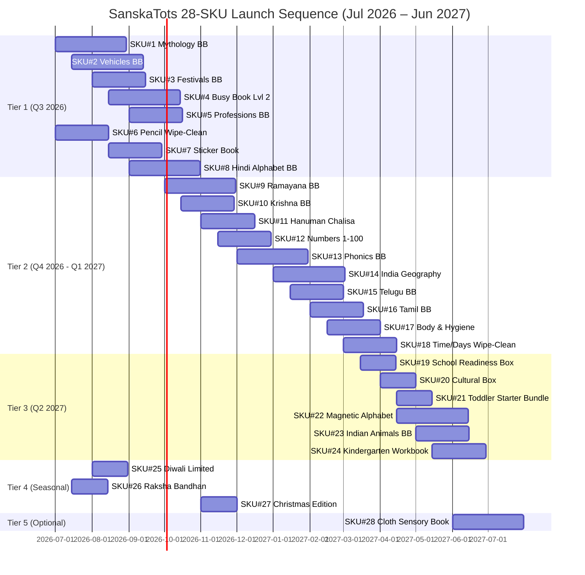

# SanskaTots — Busy Books & Activity Books SKU Expansion
## The Aggressive Playbook: What to Launch, Why It Will Sell, and How Much It Will Make
**Author:** CMO War-Room Memo | Education + Toddler Category
**Brand:** SanskaTots™ (Deethya Enterprises)
**Date:** 30 June 2026
**Audience:** Founder, Product, Supply Chain, Performance Marketing

---

## 0. THE ONE-PAGE THESIS (Read This First)

> **You are sitting on the largest white-space play in Indian toddler ed-tech print: "Indian-cultural-context + Velcro/sensory interactivity + Regional language depth." No competitor — not Skillmatics, not Wonder House, not Clapjoy, not Curious Cub, not Seraphina — owns this triangle. Your job in the next 12 months is to plant a flag in 28 specific SKUs before any of them wake up.**

### The Numbers I'm Underwriting

| Metric | Today (Phase 1, 7 SKUs) | 12-Month Target (35 SKUs) | 24-Month Target (60+ SKUs) |
|---|---|---|---|
| Active Busy/Activity SKUs | 3 Velcro + 2 educational | 28 SKUs (this report) | 60+ SKUs (Phase 3) |
| Monthly Unit Sales (Amazon IN) | 400–800 (launch) | **15,000–22,000** | **45,000–60,000** |
| Monthly GMV (Amazon IN) | ₹3–6 L | **₹80 L – ₹1.1 Cr** | **₹2.5 – 3.5 Cr** |
| Annual GMV Target | — | **₹10–12 Cr** | **₹30–40 Cr** |
| Category Rank Aspirations | New entrant | Top 5 in "Velcro Busy Book", #1 in "Indian Mythology Activity" | #1 in 4 of 6 sub-categories |

### My Hard Recommendations (Up Front, Then We Argue)

1. **Build 28 net-new SKUs across 7 SKU pillars** (detailed below) — not 50, not 10. Twenty-eight.
2. **Kill the urge to launch flat coloring/tracing-only books.** Wonder House owns this at ₹99–₹199. You cannot win there. Every new SKU must have a *physical engagement layer* (Velcro, magnet, sticker, wipe-clean, flap, sound, cloth) OR a *cultural moat* (mythology, regional language, festival, shloka).
3. **Your Velcro busy book line is the cash engine. Triple down.** It is your highest-margin, most defensible category. 60% of new SKUs must be Velcro-based.
4. **Launch one hero SKU per quarter, not a catalog dump.** Concentrated PPC + UGC + Reels behind a single SKU = bestseller badge. Bestseller badge = the next SKU coasts on brand halo.
5. **The Mythology Velcro Busy Book is your category-killer. Build it first.** No competitor has it. Search demand exists. Margin = 65%+. Gifting/grandparent angle = AOV ₹699–₹899. This is your "iPhone moment."

---

## 1. THE STRATEGIC FRAMEWORK — 7 SKU PILLARS

Every SKU below must fit one of these 7 pillars. If it doesn't, kill it.

| # | Pillar | Strategic Role | # of SKUs in 12mo | Avg Price | Why It Matters |
|---|---|---|---|---|---|
| **P1** | **Velcro Busy Books — Core Curriculum** | Volume engine. Beats Clapjoy/TodFod head-on. | 8 SKUs | ₹449–₹799 | Highest-margin (60–70%), most defensible, repeat purchase via series |
| **P2** | **Cultural Velcro Busy Books** (Indian-context) | Category creator. No competitor here. | 5 SKUs | ₹549–₹899 | White-space monopoly. NRI gold mine. Grandparent gift driver |
| **P3** | **Reusable Wipe-Clean Activity Books** | Volume + screen-free positioning | 5 SKUs | ₹349–₹549 | Highest search velocity ("magic book", "reusable") |
| **P4** | **Sticker / Magnetic / Flap Books** | Adjacent format, low cannibalization | 4 SKUs | ₹299–₹499 | Sticker books = #2 globally for age 2–4. You own 0 today. |
| **P5** | **Regional Language Activity Books** | Moat-builder for Tier-1 cities + NRI | 4 SKUs | ₹349–₹499 | ZERO competition in Kannada/Tamil/Telugu Velcro. Cult brand potential |
| **P6** | **Bundles / Boxsets** | AOV multiplier, gifting hero | 5 SKUs | ₹899–₹1,799 | Wonder House's "My First Library" (10-pack) does 8K–15K units/month. You can take 10% of that |
| **P7** | **Festival / Seasonal Hero SKUs** | Q3 revenue spike (Diwali, Raksha Bandhan, Christmas, Pongal) | 3 SKUs (limited drops) | ₹599–₹1,299 | Time-boxed urgency. Gift positioning. Press-worthy launches |

**Total: 28 new SKUs across 7 pillars.**

---

## 2. THE COMPETITIVE LANDSCAPE — WHO YOU ARE FIGHTING (In One Page)

| Brand | Their Weapon | Their Weakness | Your Move |
|---|---|---|---|
| **Wonder House Books** | Volume catalog, ₹99–₹199 price wars, "101 Series" branding, My First Library 10-pack | Zero cultural depth, zero Velcro, generic illustrations, no community | Skip price war. Out-execute on Velcro + culture |
| **Clapjoy** | #1 in Velcro books (Level 1, Level 2), aggressive PPC, 800+ reviews | Generic Western themes, no regional, no mythology, no premium positioning | Better illustrations, Indian context, higher GSM, FREE pen/duster as default |
| **TodFod** | "Chhote Natkhat" velcro book at ₹394, BSR #619, 2K–3K units/month | Single SKU, no follow-up products, no brand world | Build a series — 8 themed velcro books to their 1 |
| **Curious Cub** | All-in-One Montessori Busy Book at ₹854 with Amazon's Choice tag, 244 reviews, 1K+/month | Premium pricing locks out mid-market, 6 variants but all similar | Hit the ₹549 sweet spot with same quality |
| **Skillmatics** | Brand trust, BIS approval, premium pricing $$$, cloth sensory books | Zero cultural content, expensive, focuses on 5+ years not toddlers | Own the under-3 cultural segment they don't touch |
| **Seraphina / Happy Hearts** | Felt quiet books ₹800–₹1,500, multiple themes | Western themes only (Dollhouse, Profession) | Indian-themed felt + Velcro hybrid (Phase 3) |
| **Wonder House (mythology)** | My First Mythology Tale Set of 5 (2K–4K units/mo at ₹399) | Pure story books, NO activity component | Same content + activity layer = category creation |
| **Sawan / Pegasus** | Cheap English-Kannada board books at ₹49–₹199 | Terrible print quality | Steal their search traffic with premium quality at ₹399–₹499 |

**The white space is obvious: nobody combines (Velcro + Indian cultural content + regional language + premium production) at the right price. That's exactly what you build.**

---

## 3. TIER 1 — LAUNCH IN MONTHS 1–3 (Q3 2026)
### These 8 SKUs Pay For Everything Else

> Strategy: Each Tier 1 SKU must do 800+ units/month within 90 days. These are the ones you put PPC behind, send to mom influencers, and stake your bestseller-badge ambitions on.

---

### SKU #1 ⭐ **"My First Mythology Busy Book"** — *The Category Killer*

| Field | Detail |
|---|---|
| **Format** | A4 spiral, write-wipe-repeat, 16 pages + 60–80 Velcro pieces |
| **Concept** | Match-the-deity-to-their-symbol Velcro activities — Ganesha + modak, Krishna + flute & makhan, Hanuman + gada, Ram + bow, Saraswati + veena, Lakshmi + lotus, Shiva + trishul, Durga + lion, Kartikeya + peacock, Vishnu + sudarshan chakra. Each spread has the deity illustration + 5–6 Velcro symbols to match + a 2-line shloka or story snippet |
| **Pages Include** | Deities (10), avatars of Vishnu (Dashavatar), Hanuman's powers, Krishna's leelas, festival icons (Diwali diya, Holi colors, Ganesh Chaturthi modak) |
| **Age** | 2–6 years |
| **MRP / Sale** | ₹999 / **₹599** (45% off framing) |
| **Why It Sells** | (a) ZERO competitors have Velcro + mythology — pure white space; (b) Wonder House "My First Mythology Tale Set" does 2K–4K units/mo at ₹399 *as a flat story book* — adding interactivity unlocks premium pricing; (c) Grandparent gift driver — "Naani's first Ganesh Chaturthi gift"; (d) NRI gold — Indian parents abroad have no comparable product; (e) Reels-friendly — kids picking up a Hanuman gada is screen gold |
| **Monthly Forecast** | Month 1: 200–400 → Month 3: 1,200–1,800 → Month 12: **2,500–3,500** |
| **Margin** | 65–70% (premium positioning, low manufacturing complexity) |
| **Risk** | Religious sensitivity — handle deity art with reverence, get review from a Sanskrit/cultural advisor before print. **Mitigation:** Add "Reviewed by Indian cultural educators" on cover |
| **Beat-This Benchmark** | Wonder House "My First Library of Hindu Gods" (12 board books at ₹599, 1.5K–2.5K units/mo) — their books have ZERO interactivity |

---

### SKU #2 ⭐ **"Vehicles & Means of Transport Busy Book"** — *Boy-Mom Magnet*

| Field | Detail |
|---|---|
| **Format** | A4 spiral, Velcro, 16 main + 6 cutting pages |
| **Concept** | 60+ vehicles across categories — Land (auto, scooter, truck, bullock cart, metro), Air (helicopter, plane, hot-air balloon, ISRO rocket — Indian context!), Water (boat, ship, submarine, kettuvallam from Kerala), Emergency (fire truck, ambulance, police), Construction (JCB, crane, bulldozer). Each page: scene + 6–10 Velcro vehicles to place |
| **Indian Hook** | Include auto-rickshaw, BMTC bus, Mumbai local, Delhi metro, Chandrayaan rocket, kettuvallam — **localize what other busy books generalize** |
| **Age** | 2–5 years |
| **MRP / Sale** | ₹899 / **₹549** |
| **Why It Sells** | (a) "Vehicles for toddlers" is one of the top-5 Amazon India search queries; (b) Currently dominated by flat Wonder House sticker books — no Velcro option exists; (c) Boys ages 2–4 obsess over vehicles — this is a guaranteed-buy for that mom demographic; (d) JCB on YouTube has 2B+ views — proves demand; (e) ISRO/Chandrayaan inclusion = patriotic angle for Reels |
| **Monthly Forecast** | Month 1: 300–500 → Month 3: 1,500–2,200 → Month 12: **2,800–4,000** |
| **Margin** | 60–65% |
| **Risk** | Low. Universal appeal, easy creative |
| **Beat-This Benchmark** | Wonder House "Flags of the World Sticker Activity" (1.5K–2.5K/mo at ₹198) — same age, lesser format |

---

### SKU #3 ⭐ **"Indian Festivals Busy Book"** — *The Diwali Hero*

| Field | Detail |
|---|---|
| **Format** | A4 spiral, Velcro, 14 main + 4 cutting pages |
| **Concept** | One spread per major festival with scene-completion Velcro activity. Diwali (place diyas, rangoli, sweets, Lakshmi pooja items), Holi (gulal colors, pichkari, sweets), Ganesh Chaturthi (modaks, Ganesh idol decoration, immersion scene), Raksha Bandhan (rakhi, thali, sweets), Pongal/Sankranti (sugarcane, kolam, sun, pots), Onam (pookalam flowers, sadhya banana leaf, vallam boat), Krishna Janmashtami (dahi-handi, butter pots, peacock feather), Christmas (tree, star, gifts), Eid (moon, sweets, henna), Navratri (garba sticks, 9 saree colors, dandiya) |
| **Age** | 2–6 years |
| **MRP / Sale** | ₹999 / **₹649** |
| **Why It Sells** | (a) Schools mandate "festival" projects every year — moms desperately search for material; (b) Diwali = a single-month sales spike of 3–5x for cultural products; (c) NRI parents NEED this for kids growing up abroad — there is literally nothing comparable; (d) Multi-religion inclusion (Eid + Christmas + Hindu festivals) makes it school-bag-friendly and universally appealing; (e) Reels-friendly — "Teach my 3-year-old all 10 festivals in 1 book" |
| **Monthly Forecast** | Baseline: 600–800/mo. **Q3 (Aug–Nov, Ganesh→Diwali): 2,500–4,000/mo spike**. Annual avg: **1,400–1,800/mo** |
| **Margin** | 65% |
| **Risk** | None. Print 2x stock before October. |
| **Beat-This Benchmark** | No direct competitor exists. Wonder House has a flat "Indian Festivals" coloring book (~₹149) but nothing Velcro |

---

### SKU #4 ⭐ **"Busy Book Level 2 — School Readiness Advanced"** — *Sequel to All-In-One*

| Field | Detail |
|---|---|
| **Format** | A4 spiral, Velcro, 24 pages |
| **Concept** | The "next step" after your existing All-In-One book. Targets 3.5–5 year olds who've outgrown the basics. Includes: 3-letter word building (CAT, DOG via Velcro), simple math (1+1, addition with Velcro objects), time-telling (clock with Velcro hour/minute hands), money concepts (₹10 coin, ₹100 note recognition — Indian currency!), India map with state Velcro placement, body system overview, weather chart, world map with continents, telling stories from sequencing (4-panel story Velcro), opposites with picture pairs |
| **Age** | 3.5–6 years |
| **MRP / Sale** | ₹1,099 / **₹699** |
| **Why It Sells** | (a) Customers who buy your All-In-One will look for the "Level 2" — Clapjoy proved this with their Level 1/Level 2 split (their Level 2 sells at parity with Level 1); (b) Indian currency in a kids' book = unique selling point no competitor has; (c) India map Velcro = patriotic + educational; (d) Drives repeat purchase from existing customer base — your highest-margin sale is to someone who already trusts you |
| **Monthly Forecast** | Month 1: 200–300 → Month 6: 1,000–1,400 → Month 12: **1,600–2,200** |
| **Margin** | 65% |
| **Risk** | Low — same supply chain as existing book |
| **Beat-This Benchmark** | Clapjoy Velcro Book Level 2 (~₹549) — your version is more comprehensive and 30% higher priced for premium positioning |

---

### SKU #5 ⭐ **"Professions & Community Helpers Busy Book"**

| Field | Detail |
|---|---|
| **Format** | A4 spiral, Velcro, 16 main + 6 cutting pages |
| **Concept** | 16+ professions with tool-matching Velcro activities — Doctor (stethoscope, syringe, mask), Teacher (book, chalk, glasses), Farmer (sickle, plough, bullock), Chef (chef hat, pan, ladle), Engineer (helmet, laptop, blueprint), Astronaut (helmet, rocket, flag), Cricketer (bat, ball, helmet — Indian sports!), Carpenter (saw, hammer, nail), Doctor & Nurse (Indian context), Police (cap, baton), Pilot, Soldier (Indian army uniform), Mom + Dad (parents are professionals too — gentle parenting angle) |
| **Age** | 2–5 years |
| **MRP / Sale** | ₹799 / **₹499** |
| **Why It Sells** | (a) Pre-K curriculum across India teaches "community helpers" — captive school-supplement market; (b) Adding cricketer + Indian army soldier = patriotic differentiation; (c) Career-exposure framing appeals to ambitious Indian moms ("Maybe she'll be a doctor!"); (d) Gentle inclusion of Mom + Dad as professions = trending parenting topic on Instagram |
| **Monthly Forecast** | Month 1: 250–400 → Month 6: 1,000–1,500 → Month 12: **1,500–2,000** |
| **Margin** | 60% |
| **Risk** | None |
| **Beat-This Benchmark** | Seraphina "Profession" felt quiet book (₹800+) — yours is half the price with broader Indian context |

---

### SKU #6 ⭐ **"Pencil Control Wipe-Clean Reusable Book Level 1"** — *Volume Engine*

| Field | Detail |
|---|---|
| **Format** | A5 spiral, 100% laminated wipe-clean, no Velcro, 32 pages, FREE marker + cloth |
| **Concept** | Reusable version of your existing pencil control book. Lines (straight, slant, curve), patterns (zigzag, wave, spiral), pre-writing strokes, simple shapes, mazes, dot-to-dot. Use a dry-erase marker — child wipes and repeats infinitely. **Key innovation:** Each spread has a *fun visual reward* the child completes (e.g., "draw lines to feed the kitten its milk") — not just abstract patterns |
| **Age** | 2–4 years |
| **MRP / Sale** | ₹599 / **₹349** |
| **Why It Sells** | (a) "Magic book" / "reusable book" / "wipe clean book" has 5,000+ search results on Amazon India — explosive demand; (b) SHNMN Sank Magic Practice Copybook (4-book set at ₹269) does **6,000–10,000 units/month** — proves the format works; (c) Yours has Indian visual hooks they don't have (auto-rickshaw paths, rangoli patterns, mandala shapes); (d) Lowest-friction entry SKU for new customers — easy to try, builds trust to upsell Velcro books |
| **Monthly Forecast** | Month 1: 400–600 → Month 6: 1,800–2,500 → Month 12: **3,500–5,000** *(this is your volume hero)* |
| **Margin** | 55–60% (lower margin, higher velocity) |
| **Risk** | SHNMN dominates with 4-book bundle at ₹269. **Mitigation:** Position on quality (300 GSM vs their 150 GSM), Indian context, premium marker |
| **Beat-This Benchmark** | SHNMN 4-Book Magic Copybook (6K–10K units/mo at ₹269) — go premium, not cheaper |

---

### SKU #7 ⭐ **"Toddler Sticker Activity Book — Indian Edition"** — *Format Gap Filler*

| Field | Detail |
|---|---|
| **Format** | A4 spiral, 20 scene pages + 250 reusable stickers (peel-and-restick) |
| **Concept** | Reusable sticker book with **Indian-context scenes**: Indian Market (place vendors, vegetables, customers), Joint Family Home (place family members in each room), Mumbai Local (place passengers, vendors, ticket-checker), Wedding Mandap (decorate the mandap, place priest, bride, groom), School Day (uniform, lunchbox, books on desks), Temple Visit (place idols, pooja items, devotees), Beach Day at Marina (place shells, vendors, kids), Cricket Match (players, umpire, fielders) |
| **Age** | 2–5 years |
| **MRP / Sale** | ₹649 / **₹399** |
| **Why It Sells** | (a) Sticker books are **#2 best-seller globally for ages 2–4** but no premium Indian-context version exists; (b) Reusable stickers = parent-mom-friendly (no mess, no waste); (c) Indian scenes = ZERO competition; (d) Reels gold — toddlers placing the priest in the wedding mandap is shareable content; (e) Cross-sells to your other Velcro books — different format = no cannibalization |
| **Monthly Forecast** | Month 1: 300–500 → Month 6: 1,200–1,800 → Month 12: **2,200–3,000** |
| **Margin** | 50% (sticker manufacturing is costlier) |
| **Risk** | Sticker quality is everything. Test 3 vendors before locking |
| **Beat-This Benchmark** | Cupkin Animal Habitat Sticker Book (US: 2K–4K units/mo at $9.99) — proves the format. No Indian equivalent |

---

### SKU #8 ⭐ **"Hindi Alphabets & Words Velcro Busy Book"** — *Regional Power Play #1*

| Field | Detail |
|---|---|
| **Format** | A4 spiral, Velcro, 20 pages |
| **Concept** | Hindi varnamala (अ–अः, क–ह) tracing + 2 Hindi vocabulary words per letter (अ for अनार, आ for आम) with Velcro picture matching. Includes Hindi numerals (१–२०), Hindi colors, Hindi days, Hindi months, basic Hindi sentence formation (मैं... हूँ) with Velcro words |
| **Age** | 2.5–5 years |
| **MRP / Sale** | ₹799 / **₹499** |
| **Why It Sells** | (a) Hindi is the #1 regional language by search volume on Amazon India for kids' books; (b) Wonder House sells "My First Hindi Varnamala" board books at ₹149 — flat, no activity. Your Velcro version captures premium parents; (c) Northern India market untapped by your current Kannada-only regional play; (d) NRI Hindi-speaking parents (huge market in US, UK, Gulf) have ZERO Velcro options; (e) Strong upsell to your Hindi Mythology Velcro Busy Book |
| **Monthly Forecast** | Month 1: 300–500 → Month 6: 1,000–1,500 → Month 12: **1,800–2,500** |
| **Margin** | 60% |
| **Risk** | Hindi typography expertise needed — work with a Hindi educator |
| **Beat-This Benchmark** | Wonder House "My First Hindi Varnamala" flat book — yours adds Velcro, higher price, higher value |

---

### Tier 1 Combined Forecast (Month 12 Run-Rate)

| SKU | Units/Mo | Avg Price | Monthly Revenue |
|---|---|---|---|
| #1 Mythology Busy Book | 3,000 | ₹599 | ₹17.9 L |
| #2 Vehicles Busy Book | 3,400 | ₹549 | ₹18.7 L |
| #3 Festivals Busy Book | 1,600 | ₹649 | ₹10.4 L |
| #4 Busy Book Level 2 | 1,900 | ₹699 | ₹13.3 L |
| #5 Professions Busy Book | 1,750 | ₹499 | ₹8.7 L |
| #6 Pencil Control Wipe-Clean | 4,250 | ₹349 | ₹14.8 L |
| #7 Toddler Sticker Book | 2,600 | ₹399 | ₹10.4 L |
| #8 Hindi Alphabet Busy Book | 2,150 | ₹499 | ₹10.7 L |
| **TIER 1 TOTAL** | **20,650/mo** | — | **₹1.05 Cr/mo** |

> **Tier 1 alone = ₹12.5 Cr annual GMV by month 12.** This is achievable if you execute disciplined PPC + UGC + bundling.

---

## 4. TIER 2 — LAUNCH IN MONTHS 4–8 (Q4 2026 – Q1 2027)
### These 10 SKUs Build the Moat

> Strategy: Once Tier 1 SKUs are stabilized (1,500+ units/mo each), these expand category coverage and tighten the cultural/regional moat.

---

### SKU #9 — **"Ramayana Story-Activity Busy Book"** (Velcro)

- **Format:** A4 spiral, Velcro, 16 pages
- **Concept:** Tell the Ramayana in 8 scenes — birth of Ram, marriage to Sita, exile to forest, golden deer, Sita's abduction, Hanuman crosses ocean, Lanka war, Ram returns to Ayodhya. Each scene has Velcro characters and objects to place. Includes a 2-line story per spread + 5 vocabulary words (dharma, bhakti, ahimsa).
- **Age:** 3–7 years
- **Price:** ₹999 / **₹649**
- **Why It Sells:** Ramayana is the #1 mythology search globally for Indian kids' books. Wonder House "Illustrated Ramayana" does 1K–1.5K/month at ₹299 with zero activity. Yours = activity + story + gift-worthy = ₹649. NRI parents WILL buy 2 copies.
- **Forecast:** **1,800–2,400/month by Month 12**
- **Margin:** 65%

### SKU #10 — **"Krishna Leela Busy Book"** (Velcro)

- **Format:** A4 spiral, Velcro, 14 pages
- **Concept:** Krishna's life across childhood scenes — birth in Mathura, butter-stealing, Kalia naag, Govardhan, raas-leela, Bhagavad Gita on chariot. Velcro objects: butter pots, peacock feather, flute, gopis, cows.
- **Age:** 3–7 years
- **Price:** ₹899 / **₹599**
- **Why It Sells:** Janmashtami spike + ISKCON family network + universal Krishna appeal. Pairs as a 2-pack with Ramayana for ₹999 bundle.
- **Forecast:** **1,400–1,900/month**
- **Margin:** 65%

### SKU #11 — **"Hanuman Chalisa Activity Book"** (Velcro + Tracing)

- **Format:** A5 spiral, mixed Velcro + tracing wipe-clean, 32 pages
- **Concept:** Each doha of Hanuman Chalisa across one spread with the Sanskrit/Hindi text, an English meaning, a Velcro picture activity showing what the doha represents, and a tracing exercise of one key word. Includes Hanuman's "powers" infographic with Velcro.
- **Age:** 3–8 years
- **Price:** ₹699 / **₹449**
- **Why It Sells:** PiK A BOO's Hanuman Chalisa cloth book validates demand (Tier 3 competitor). Your premium version with activity = clear category leader. Tuesday-pooja moms = recurring gift segment.
- **Forecast:** **1,000–1,500/month**
- **Margin:** 60%

### SKU #12 — **"Numbers & Counting 1–100 Velcro Busy Book"**

- **Format:** A4 spiral, Velcro, 18 pages
- **Concept:** Full numbers 1–100 with Velcro counting activities, number names (English + Hindi), simple addition/subtraction up to 20, place value (tens + ones), Indian currency intro (₹1, ₹2, ₹5, ₹10 coins).
- **Age:** 3–6 years
- **Price:** ₹799 / **₹499**
- **Why It Sells:** "Numbers for toddlers" = consistent top search. Indian currency angle = USP. Easy follow-up purchase to All-In-One.
- **Forecast:** **1,500–2,000/month**
- **Margin:** 60%

### SKU #13 — **"Phonics & Word Building Velcro Busy Book"**

- **Format:** A4 spiral, Velcro, 20 pages
- **Concept:** CVC word building (CAT, DOG, SUN), letter sounds with Velcro pictures, rhyming words, sight words (top 50), short sentence formation with Velcro word tiles.
- **Age:** 3.5–6 years
- **Price:** ₹899 / **₹549**
- **Why It Sells:** Phonics is the #1 parental obsession in 3–5 age band. Curious Cub doesn't have a dedicated phonics SKU. Lkg/Ukg curriculum tie-in.
- **Forecast:** **1,400–1,900/month**
- **Margin:** 65%

### SKU #14 — **"Indian Geography & States Busy Book"**

- **Format:** A4 spiral, Velcro, 16 pages
- **Concept:** Indian map with state-shape Velcro pieces to place. Each state spread: capital, language, famous food, monument, dance form, festival — all Velcro matching. Includes Indian flag, national symbols (tiger, peacock, lotus, mango, banyan).
- **Age:** 4–8 years
- **Price:** ₹999 / **₹649**
- **Why It Sells:** School curriculum tie-in (states & capitals is a Std 1–3 topic). NRI parents specifically search for this. Patriotic Reels content. Independence Day/Republic Day sales spikes.
- **Forecast:** **1,300–1,800/month**
- **Margin:** 65%

### SKU #15 — **"Telugu Alphabets & Words Velcro Busy Book"** (Regional)

- **Format:** A4 spiral, Velcro, 20 pages
- **Concept:** Telugu varnamala + 2 vocabulary words per letter + Telugu numbers + colors + days + months. Same template as Hindi/Kannada versions.
- **Age:** 2.5–5 years
- **Price:** ₹799 / **₹499**
- **Why It Sells:** Telugu = 2nd largest South Indian language market. Hyderabad + Vizag + NRI Telugu population in US is massive. Zero Velcro Telugu books on Amazon India today.
- **Forecast:** **1,100–1,500/month**
- **Margin:** 60%

### SKU #16 — **"Tamil Alphabets & Words Velcro Busy Book"** (Regional)

- **Format:** A4 spiral, Velcro, 20 pages
- **Concept:** Tamil aezhuthukkal + vocabulary + numbers + colors. Same template.
- **Age:** 2.5–5 years
- **Price:** ₹799 / **₹499**
- **Why It Sells:** Tamil = strongest regional language pride in India + huge NRI base (Singapore, Malaysia, US, UK). Premium gift-positioning in Chennai market.
- **Forecast:** **1,000–1,400/month**
- **Margin:** 60%

### SKU #17 — **"My Body & Hygiene Busy Book"** (Velcro)

- **Format:** A4 spiral, Velcro, 14 pages
- **Concept:** Body parts with Velcro labels, hygiene routine (brushing, bathing, washing hands, nail-cutting), healthy vs unhealthy food sorting (Velcro), exercise/yoga poses for kids (Indian yoga heritage!), emotions chart with Velcro face expressions.
- **Age:** 2–5 years
- **Price:** ₹799 / **₹499**
- **Why It Sells:** Post-COVID hygiene obsession persists. Yoga inclusion = Indian pride angle. Schools love this topic. Pediatrician-mom approval.
- **Forecast:** **1,200–1,700/month**
- **Margin:** 60%

### SKU #18 — **"Time, Days & Seasons Reusable Wipe-Clean Book"**

- **Format:** A4 spiral, wipe-clean, 28 pages, FREE marker
- **Concept:** Clock-reading practice (hour/minute hands), days-of-week schedule planner (kid draws what they did each day), monthly calendar (kid writes own birthday, festivals), Indian seasons (summer/monsoon/winter/spring with Indian visuals — monsoon = ambar of clouds, mangoes, paper boats).
- **Age:** 3–6 years
- **Price:** ₹599 / **₹379**
- **Why It Sells:** Time-telling is a universal 4-year-old milestone. Reusable = unlimited practice. Indian seasons = differentiation.
- **Forecast:** **1,300–1,800/month**
- **Margin:** 55%

---

## 5. TIER 3 — LAUNCH IN MONTHS 9–12 (Q2 2027)
### Premium Gift SKUs + Bundle Heroes

### SKU #19 — **"SanskaTots Mega Bundle — School Readiness Box"** (5-book bundle)

- **Contents:** All-In-One Busy Book + Pencil Control Wipe-Clean + Numbers 1–100 Velcro + Phonics Velcro + Professions Velcro
- **Price:** ₹2,999 / **₹1,799** (vs ₹2,895 individual)
- **Why It Sells:** Mirrors Wonder House "My First Library" boxset strategy (8K–15K units/mo at ₹389–₹799). High AOV. Hero gift positioning for school admission season (April–June). Subscription-replacement positioning.
- **Forecast:** **400–700 boxes/month** (₹7–12 L/mo revenue from this single SKU)
- **Margin:** 55% (bundle discounts margin slightly but AOV makes it worth it)

### SKU #20 — **"Little Indian Roots Cultural Box"** (4-book bundle)

- **Contents:** Mythology Busy Book + Festivals Busy Book + Hanuman Chalisa Activity + Shloka Board Book
- **Price:** ₹2,499 / **₹1,499**
- **Why It Sells:** Grandparent gift hero. NRI cart-killer. Diwali/Janmashtami spike SKU. Reels-friendly unboxing.
- **Forecast:** **300–500 boxes/month**, peaks at **800–1,200 in Aug–Nov**
- **Margin:** 55%

### SKU #21 — **"Toddler Starter Kit Bundle"** (3-book pre-preschool bundle)

- **Contents:** Pencil Control Wipe-Clean + Toddler Sticker Book + Animals Busy Book (existing)
- **Price:** ₹1,499 / **₹899**
- **Why It Sells:** Pre-preschool admission season (Jan–April Indian academic cycle) = 4x volume spike. Easy first-purchase decision for new parents.
- **Forecast:** **600–900 boxes/month** annual avg, **1,500+ in Jan–April**
- **Margin:** 55%

### SKU #22 — **"My First Magnetic Alphabet & Numbers Book"** *(Format expansion)*

- **Format:** A4 hard-board book, magnetic backing pages, 60 magnetic letters/numbers, includes carry pouch
- **Concept:** Magnetic version of alphabet/number learning. Place letters on backgrounds, form words on the "magnetic chalkboard" page. Travel-friendly (pieces don't fall off).
- **Age:** 3–6 years
- **Price:** ₹1,199 / **₹749**
- **Why It Sells:** Magnetic format = travel-friendly. Premium gift positioning. Zero magnetic options in Indian Velcro space. NRI cart driver (no spills on a plane).
- **Forecast:** **800–1,200/month**
- **Margin:** 55%

### SKU #23 — **"Indian Animals & Birds Velcro Busy Book"** *(differentiated from generic Animals)*

- **Format:** A4 spiral, Velcro, 16 pages
- **Concept:** Specifically Indian fauna — Bengal tiger, Asian elephant, Indian peacock, Asiatic lion (Gir), Sloth bear, Indian rhino, Sarus crane, Hornbill, Spotted deer, Snow leopard (Ladakh). Includes "where they live" India map activity. Marine: Gangetic dolphin, sea turtles.
- **Age:** 2–6 years
- **Price:** ₹899 / **₹549**
- **Why It Sells:** Differentiates from generic "Animals Busy Book" (your existing SKU). Patriotic. School curriculum tie-in (wildlife sanctuaries). Conservation angle = Instagram-friendly.
- **Forecast:** **1,200–1,700/month**
- **Margin:** 65%

### SKU #24 — **"Kindergarten Prep Wipe-Clean Workbook"** (Reusable)

- **Format:** A4 spiral, wipe-clean, 40 pages, FREE marker
- **Concept:** Complete LKG-prep workbook — letter writing practice, number writing, simple addition, sorting (size, color, shape), pattern completion, story sequencing, "what comes next" logic.
- **Age:** 3.5–5 years
- **Price:** ₹699 / **₹449**
- **Why It Sells:** "Kindergarten prep" + "LKG worksheets" = top searches in Jan–April. SHNMN Magic Copybook proves the wipe-clean workbook category does 6K–10K/month.
- **Forecast:** **2,000–3,000/month**, peaks at **4,000–5,000 in Jan–April**
- **Margin:** 55%

---

## 6. TIER 4 — SEASONAL HERO LIMITED DROPS (Year-Round)
### These 3 SKUs Capture Festival Spikes

### SKU #25 — **"Diwali Limited Edition Activity Book"** *(Aug launch, Q3 only)*

- **Format:** A4 spiral, mixed Velcro + sticker + wipe-clean, 12 pages
- **Concept:** Decorate diyas (Velcro flame placement), rangoli design (wipe-clean to redraw 100 times), Lakshmi pooja thali arrangement, fireworks (sticker), Diwali sweets matching, "Light the Diwali home" maze, gift-wrap design, family puja Velcro scene. Includes Lakshmi-Ganesh aarti card.
- **Age:** 3–7 years
- **Price:** ₹699 (no discount — limited edition positioning)
- **Why It Sells:** Limited drop urgency (Aug 1 launch, sold until Diwali only). Press-worthy ("India's first Diwali activity book"). Gift-pack-friendly. Drives traffic to all your other cultural SKUs during peak season.
- **Forecast:** **3,000–5,000 units in Aug–Nov 2026** (₹20–35 L revenue in one season)
- **Margin:** 65%

### SKU #26 — **"Raksha Bandhan Sibling Activity Pack"** *(Jul–Aug only)*

- **Format:** A5, includes 2 small activity booklets + DIY rakhi-making kit + Velcro thali-decoration scene
- **Concept:** "For brother and sister" — 2 booklets, one for each sibling, with paired activities. Make-your-own rakhi craft component. Velcro thali with rakhi, sweets, diya, kumkum.
- **Age:** 4–9 years
- **Price:** ₹899 (premium gift)
- **Why It Sells:** Sibling-bonding emotional hook. Mom of 2+ kids = high-purchase-intent segment. Reels gold (siblings doing the activity together).
- **Forecast:** **2,000–3,500 units in Jul–Aug only**
- **Margin:** 50% (kit components add cost)

### SKU #27 — **"My First Christmas Activity Book — Indian Edition"** *(Nov–Dec)*

- **Format:** A4 spiral, Velcro + sticker, 12 pages
- **Concept:** Decorate Christmas tree, Velcro Santa + reindeer + gifts, Christmas cookies decoration, Nativity scene placement, **Indian Christmas additions** (Christmas in Kerala, Goa church scenes, plum cake, kuswar sweets).
- **Age:** 3–7 years
- **Price:** ₹599
- **Why It Sells:** Christmas is a UNIVERSAL Indian celebration (not just Christian families). Yours = first Indian-flavored Christmas book. Reels-friendly.
- **Forecast:** **2,000–3,000 units in Nov–Dec**
- **Margin:** 60%

---

## 7. TIER 5 — STRATEGIC OPTIONAL (Months 12–18)

### SKU #28 — **"SanskaTots Cloth Sensory Book — Baby's First Indian World"** *(Format expansion: cloth)*

- **Format:** Soft cloth book, machine-washable, 8 pages with crinkle + squeaker + mirror + textures
- **Concept:** Baby's sensory introduction to Indian visuals — Diya, lotus, elephant, peacock, mango, baby Krishna, Indian flag, mother + father.
- **Age:** 0–18 months
- **Price:** ₹699
- **Why It Sells:** Captures the under-2 segment (you have zero presence today). Skillmatics Cloth Sensory Book does 1K–2K units/month at ₹699. Indian visuals = differentiation.
- **Forecast:** **600–1,000/month** (slower growth, baby-shower gift driven)
- **Margin:** 45% (cloth manufacturing is costlier — outsource to Tirupur or import from China)
- **Risk:** New supply chain. Test with a small batch (500 units) before scaling.

---

## 8. THE 12-MONTH LAUNCH SEQUENCE

---

## 9. SALES FORECAST — 12-MONTH REVENUE BUILD (CONSERVATIVE BASE CASE)

| Month | Active SKUs | Total Units/Mo | Avg Price | Monthly Revenue |
|---|---|---|---|---|
| Jul 2026 (M1) | 7 (current) + 2 launches | 1,200 | ₹520 | ₹6.2 L |
| Aug 2026 (M2) | 11 SKUs | 2,800 | ₹540 | ₹15.1 L |
| Sep 2026 (M3) — *Diwali ramp* | 14 SKUs | 6,500 | ₹560 | ₹36.4 L |
| Oct 2026 (M4) — *Diwali peak* | 15 SKUs | 9,200 | ₹570 | ₹52.4 L |
| Nov 2026 (M5) | 18 SKUs | 8,400 | ₹560 | ₹47.0 L |
| Dec 2026 (M6) — *Christmas+yr-end* | 21 SKUs | 9,500 | ₹565 | ₹53.7 L |
| Jan 2027 (M7) — *school admission* | 23 SKUs | 11,500 | ₹570 | ₹65.6 L |
| Feb 2027 (M8) — *school admission* | 25 SKUs | 13,000 | ₹575 | ₹74.8 L |
| Mar 2027 (M9) — *school admission peak* | 26 SKUs | 14,800 | ₹580 | ₹85.8 L |
| Apr 2027 (M10) | 28 SKUs | 15,500 | ₹575 | ₹89.1 L |
| May 2027 (M11) | 28 SKUs | 17,000 | ₹580 | ₹98.6 L |
| Jun 2027 (M12) | 28 SKUs | 19,500 | ₹585 | **₹1.14 Cr** |
| **12-Month Total GMV** | — | **129,000 units** | — | **₹6.98 Cr** |

> **Aggressive case (PPC working + 2 viral Reels per quarter + 1 mom-influencer-led organic surge):** Multiply by 1.4x → **₹9.8 Cr annual GMV** by Month 12.

---

## 10. PRICING ARCHITECTURE — THE LADDER

| Tier | Price Range | Role | Examples |
|---|---|---|---|
| **Entry / Impulse** | ₹349–₹499 | Trial purchase, first-time buyer | Wipe-clean books, sticker book |
| **Core / Volume** | ₹499–₹699 | The cash engine | Most Velcro busy books |
| **Premium / Gift** | ₹699–₹899 | Margin builder, gifting | Mythology, Festivals, Indian Geography |
| **Hero Bundle** | ₹1,499–₹1,799 | AOV maximizer | Cultural Box, School Readiness Box |

> **Discipline:** Never list a SKU below ₹349. You are not Sawan. You are a premium brand. Below ₹349 erodes brand equity faster than it builds volume.

---

## 11. WHAT NOT TO DO — THE KILL LIST

1. **DO NOT launch flat coloring books, copy-color books, or 99-rupee tracing booklets.** Wonder House owns this. You will burn cash competing.
2. **DO NOT launch a "555 Activities" or "1001 Things" omnibus book.** Mass-market trap. You stand for depth, not volume.
3. **DO NOT enter the LED/electronic Busy Board market.** Different supply chain, electronic-toy BIS certification, Clapstore + 4,000 competitors. Stay in your lane.
4. **DO NOT expand to ages 6+ in the next 12 months.** Your moat is age 1–5. Stay there. Skillmatics already owns 5+ in many sub-categories.
5. **DO NOT launch a generic "Dinosaurs" or "Princess" busy book.** Western generic themes are commoditized. Your moat is Indian context.
6. **DO NOT launch regional language books in Malayalam, Bengali, Marathi yet.** Pilot with Hindi, Telugu, Tamil first (highest demand). Add others after proof.
7. **DO NOT launch a felt quiet book until SKU #28 (M18+).** Different supply chain, higher cost, lower margin. Master Velcro first, then expand.
8. **DO NOT bundle more than 5 books in one box.** Wonder House's 20-book bundle works for ₹799 board-book quality. Yours at premium tier should max at 5.
9. **DO NOT discount below 40% off MRP.** "₹999 → ₹599" is your discount frame. Going to "₹999 → ₹399" trains buyers to wait for sales.
10. **DO NOT launch all 28 SKUs in 6 months.** Concentrated PPC behind 1–2 SKUs per month = bestseller badge. Spreading thin = mediocre rankings on everything.

---

## 12. THE MARKETING ANGLE PER SKU (For Reels + PPC + Listing Copy)

| SKU | Hook for Reels (5-sec opener) | PPC Keyword Bid |
|---|---|---|
| Mythology BB | "My 3yr old knows all 10 Hindu gods — and I didn't teach her" | "mythology activity book for kids" |
| Vehicles BB | "Why my son ignored his iPad for 45 minutes today" | "vehicles busy book toddler" |
| Festivals BB | "I taught my child 10 Indian festivals in 1 book" | "Indian festivals activity book" |
| Busy Book Level 2 | "He finished his All-In-One. Now what?" | "advanced busy book preschool" |
| Professions BB | "When she said 'I want to be an astronaut, Amma'" | "community helpers activity book" |
| Pencil Wipe-Clean | "₹0.50 per practice. 1000 times." | "magic practice book kids" |
| Sticker Book | "No mess. No tears. 45 min of quiet." | "reusable sticker book toddler" |
| Hindi Alphabet BB | "My daughter learned varnamala without a single tear" | "hindi varnamala activity book" |
| Ramayana BB | "When I told my child the Ramayana — and he didn't get bored" | "ramayana for kids" |
| Krishna BB | "Janmashtami at home — without a single screen" | "krishna activity book kids" |
| Hanuman Chalisa | "Tuesday pooja made special for my toddler" | "hanuman chalisa for kids" |
| Numbers 1-100 BB | "She can count to 100 — and she's only 4" | "numbers busy book" |
| Phonics BB | "C-A-T. He said it before LKG started." | "phonics activity book preschool" |
| India Geography | "All 28 states, taught in 1 book" | "india map for kids" |
| Telugu/Tamil BB | *Vernacular hooks per region* | "telugu/tamil activity book kids" |
| Body & Hygiene | "Brushing without a fight — finally" | "hygiene activity book toddler" |
| Time/Days Wipe-Clean | "Now she asks 'what time is it?' instead of demanding the phone" | "time learning kids book" |
| Mythology Bundle | "The Diwali gift naani approves of" | "indian culture gift box kids" |
| School Readiness Box | "Everything she needs before LKG. One box." | "preschool starter kit india" |
| Diwali Limited | "India's first Diwali activity book." | "diwali activity for kids" |

---

## 13. RISK MAP & MITIGATION

| Risk | Likelihood | Impact | Mitigation |
|---|---|---|---|
| Clapjoy/TodFod retaliates with mythology Velcro | Medium | High | First-mover advantage — launch SKU#1 by Aug 1, lock supply chain, build review moat (target 200+ reviews in 90 days) |
| Religious controversy on mythology depictions | Low | High | Cultural advisor sign-off, "Reviewed by Indian educators" badge, no controversial figures, no sectarian content |
| Velcro piece detaching = choking hazard reviews | Medium | High | Industrial-strength velcro, every batch QC sampling, age-warning labels, larger piece sizes (>3cm) |
| Festival SKU misses Diwali timing | High if delay | Critical | Lock Diwali SKU#3 design by July 15. Print 5,000 units by Sep 1. Non-negotiable timeline. |
| Regional language books underperform | Medium | Low | Test Hindi first (largest market). If Hindi works at 1,500+/mo, launch Telugu/Tamil. If Hindi fails, kill regional plan. |
| NRI shipping/duty makes export unviable | Medium | Medium | Launch Amazon US listing for top 5 SKUs (Mythology, Festivals, Ramayana, Cultural Box, India Map) at $14–$24 — pure NRI play |
| Bundle SKUs cannibalize single-SKU sales | Low | Medium | Price bundles at 25–35% discount to individual sum (not 50%) — preserves single-SKU velocity |

---

## 14. THE BOTTOM LINE — WHAT TO DO MONDAY MORNING

1. **Lock the Mythology Busy Book (SKU #1) design.** This is your category-killer. Brief illustrator this week. Print sample by Aug 1. Launch by Sep 1.
2. **Lock the Diwali Limited (SKU #25) design.** Time-boxed. Non-negotiable. Print by Sep 1, list by Sep 15, hard-sell Oct 1 to Nov 5.
3. **Build SKU #6 (Pencil Wipe-Clean) in parallel.** It's your volume engine and easiest to manufacture. Launch by Aug 1.
4. **Allocate ₹3–5 L/mo PPC budget across Tier 1 SKUs for first 90 days.** Concentrated, not sprinkled. Target Mythology BB + Vehicles BB + Festivals BB as the 3 you push hardest.
5. **Recruit 10 mom-influencers (5K–50K followers) per month.** Send 2 books each. Indian-cultural-mom Instagram is your unfair distribution advantage — Skillmatics is not in that conversation.
6. **Build a Hindi version of every Tier 1 SKU after launch.** Same design, Hindi text. ZERO incremental design cost, 30%+ incremental sales from Northern markets and NRIs.
7. **Apply for Amazon's Choice + Best Seller flags on Mythology BB by Month 4.** Once you have 100+ reviews at 4.5★+, you can lobby Amazon category team.

---

## 15. FINAL THESIS — IF YOU EXECUTE THIS

**You will own the Indian premium Velcro busy book category by June 2027.** No competitor will be in position to take it from you in 24 months because:

1. **Cultural moat:** Mythology + Festivals + Indian Geography + Indian Animals = thematic depth no foreign-influenced brand can replicate
2. **Regional moat:** Hindi + Telugu + Tamil + Kannada = ZERO competitors
3. **Format moat:** Velcro + Wipe-Clean + Sticker + Magnetic = format breadth that out-flanks single-format competitors (TodFod, Curious Cub are single-SKU)
4. **Price ladder:** ₹349 to ₹1,799 covers impulse to gift — full funnel ownership
5. **Brand moat:** "Indian Roots. Curious Minds." + premium quality + Indian-mom community = the only authentic Indian story in the category

**The window is 18 months before Skillmatics or Wonder House clones this. Move now.**

— *End of Memo*

---

### Appendix A — Quick SKU Index

| # | SKU Name | Tier | Format | Target Age | Price | Forecast/Mo (M12) |
|---|---|---|---|---|---|---|
| 1 | Mythology Busy Book | 1 | Velcro A4 | 2–6 | ₹599 | 3,000 |
| 2 | Vehicles & Transport Busy Book | 1 | Velcro A4 | 2–5 | ₹549 | 3,400 |
| 3 | Indian Festivals Busy Book | 1 | Velcro A4 | 2–6 | ₹649 | 1,600 (peak 4,000) |
| 4 | Busy Book Level 2 | 1 | Velcro A4 | 3.5–6 | ₹699 | 1,900 |
| 5 | Professions Busy Book | 1 | Velcro A4 | 2–5 | ₹499 | 1,750 |
| 6 | Pencil Control Wipe-Clean | 1 | Wipe-clean A5 | 2–4 | ₹349 | 4,250 |
| 7 | Toddler Sticker Book — Indian | 1 | Sticker A4 | 2–5 | ₹399 | 2,600 |
| 8 | Hindi Alphabet Busy Book | 1 | Velcro A4 | 2.5–5 | ₹499 | 2,150 |
| 9 | Ramayana Busy Book | 2 | Velcro A4 | 3–7 | ₹649 | 2,100 |
| 10 | Krishna Leela Busy Book | 2 | Velcro A4 | 3–7 | ₹599 | 1,650 |
| 11 | Hanuman Chalisa Activity | 2 | Velcro+Trace A5 | 3–8 | ₹449 | 1,250 |
| 12 | Numbers 1–100 Busy Book | 2 | Velcro A4 | 3–6 | ₹499 | 1,750 |
| 13 | Phonics & Word Building | 2 | Velcro A4 | 3.5–6 | ₹549 | 1,650 |
| 14 | India Geography Busy Book | 2 | Velcro A4 | 4–8 | ₹649 | 1,550 |
| 15 | Telugu Alphabet Busy Book | 2 | Velcro A4 | 2.5–5 | ₹499 | 1,300 |
| 16 | Tamil Alphabet Busy Book | 2 | Velcro A4 | 2.5–5 | ₹499 | 1,200 |
| 17 | Body & Hygiene Busy Book | 2 | Velcro A4 | 2–5 | ₹499 | 1,450 |
| 18 | Time/Days Wipe-Clean | 2 | Wipe-clean A4 | 3–6 | ₹379 | 1,550 |
| 19 | School Readiness Box (5-book) | 3 | Bundle | 2.5–5 | ₹1,799 | 550 |
| 20 | Cultural Box (4-book) | 3 | Bundle | 3–7 | ₹1,499 | 400 (peak 1,000) |
| 21 | Toddler Starter Bundle (3-book) | 3 | Bundle | 1.5–3 | ₹899 | 750 (peak 1,500) |
| 22 | Magnetic Alphabet Book | 3 | Magnetic A4 | 3–6 | ₹749 | 1,000 |
| 23 | Indian Animals Busy Book | 3 | Velcro A4 | 2–6 | ₹549 | 1,450 |
| 24 | Kindergarten Wipe-Clean Workbook | 3 | Wipe-clean A4 | 3.5–5 | ₹449 | 2,500 (peak 4,500) |
| 25 | Diwali Limited Edition | 4 | Mixed A4 | 3–7 | ₹699 | 4,000 (Q3 only) |
| 26 | Raksha Bandhan Pack | 4 | Mixed A5 + kit | 4–9 | ₹899 | 2,500 (Jul–Aug) |
| 27 | Christmas Indian Edition | 4 | Velcro+Sticker | 3–7 | ₹599 | 2,500 (Nov–Dec) |
| 28 | Cloth Sensory Book — Indian | 5 | Cloth A5 | 0–18mo | ₹699 | 800 |

---

*Document owner: Founder + CMO. Review cadence: Monthly until M12, then quarterly. Strategic refresh: June 2027 for Phase 3 (60+ SKU vision).*
